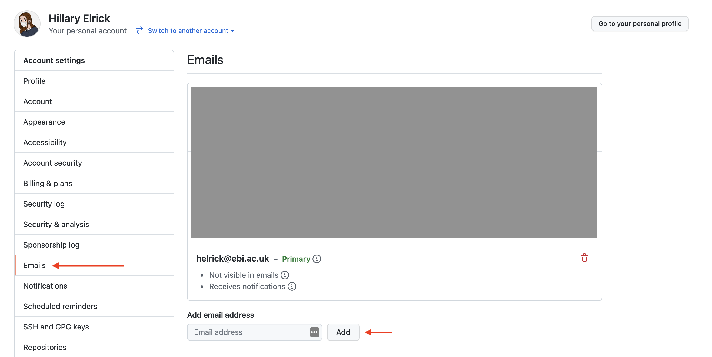
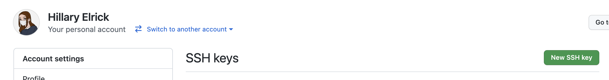
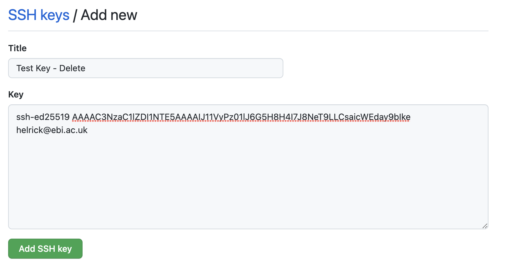
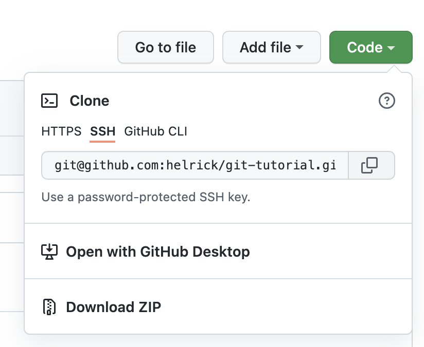

# Git Tutorial

Git Tutorial for the Primers for Predocs course, January 2022

## Contents
[Prerequisites](#prerequisites)<br>
[Set-up](#set-up)<br>

## Prerequisites
* GitHub account which you can log in to (please send me a slack message with this account)
* Record of an email associated to your GitHub account [settings](https://github.com/settings/emails). You should have access to the primary email on your account. Feel free to add your institutional (i.e. EBI or Sanger) email address.


## Set-up
 > **Background**: last summer, GitHub removed support for password authentication, requiring users to use a Personal Access Token (PAT) or to Authenticate with SSH. I prefer the SSH method, so that's what I'll be showing, though other options are possible. This method requires you to generate an SSH-key for every machine from which you'll push code to GitHub (i.e. the cluster, your laptop, any VM). It also requires that when you want to clone a repository, you'll need to  copy a repository's URL (to clone it), you'll need to copy the SSH link rather than the HTTPS link (don't worry if none of this makes sense, we'll go over it).

1) Log into the VM (see course instructions for this)

2) Open the Terminal, and on the command-line run:
    ```bash
    mkdir -p ~/.ssh && cd ~/.ssh
    ssh-keygen -t ed25519 -f github_key -C "<your_github_email@example.com>" -N ''
    cat ~/.ssh/github_key.pub
    ```
    Copy the output of the last command.
3) In a browser, go to your [GitHub SSH keys](https://github.com/settings/keys) and click 'New SSH key'

Enter a name (anything works but I prefer to give it a descriptive one based on the machine I've generated it on), and paste in the output of the previous command (your SSH public key).


4) Return to the VM and create an `~/.ssh/config` file via `touch ~/.ssh/config`. Open it with your favourite text editor (vim, nano, emacs) and paste in the following:
    ```bash
    Host github.com
        HostName github.com
            IdentityFile ~/.ssh/github_key
    ```
5) Set your local git user by running:
    ```bash
    git config --global user.email "<your_github_email@example.com>"
    git config --global user.name "Your Name"
    ```
    The email must be associated to your GitHub account
6) Copy this repository's URL `git@github.com:helrick/git-tutorial.git` either from this link or by clicking the **Code** button on the top right of the repository:

7) Test cloning this repository on your VM:
    ```bash
    cd ~/Documents
    git clone git@github.com:helrick/git-tutorial.git
    ```
    This should create a folder, `git-tutorial` in your `Documents` directory containing the code from this repo.
