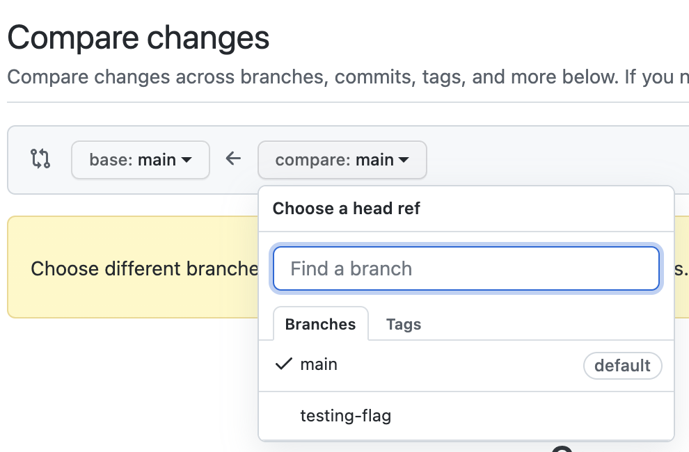

# Git Tutorial

Git Tutorial for the Primers for Predocs course, January 2022

## Contents
[Prerequisites](#prerequisites)<br>
[Set-up](#set-up)<br>
[Create a Branch](#create-a-branch)<br>
[Open a Pull Request](#open-a-pull-request)<br>

## Prerequisites
* GitHub account which you can log in to (please send me a slack message with this account)
* Record of an email associated to your GitHub account [settings](https://github.com/settings/emails). You should have access to the primary email on your account. Feel free to add your institutional (i.e. EBI or Sanger) email address.


## Set-up
 > **Background**: last summer, GitHub removed support for password authentication, requiring users to use a Personal Access Token (PAT) or to Authenticate with SSH. I prefer the SSH method, so that's what I'll be showing, though other options are possible. This method requires you to generate an SSH-key for every machine from which you'll push code to GitHub (i.e. the cluster, your laptop, any VM). It also requires that when you want to clone a repository, you'll need to  copy a repository's URL (to clone it), you'll need to copy the SSH link rather than the HTTPS link (don't worry if none of this makes sense, we'll go over it).

1) Log into the VM (see course instructions for this)

2) Open the Terminal, and on the command-line run:
    ```bash
    mkdir -p ~/.ssh && cd ~/.ssh
    ssh-keygen -t ed25519 -f github_key -C "<your_github_email@example.com>" -N ''
    cat ~/.ssh/github_key.pub
    ```
    Copy the output of the last command.
3) In a browser, go to your [GitHub SSH keys](https://github.com/settings/keys) and click 'New SSH key'

Enter a name (anything works but I prefer to give it a descriptive one based on the machine I've generated it on), and paste in the output of the previous command (your SSH public key).


4) Return to the VM and create an `~/.ssh/config` file via `touch ~/.ssh/config`. Open it with your favourite text editor (vim, nano, emacs) and paste in the following:
    ```bash
    Host github.com
        HostName github.com
            IdentityFile ~/.ssh/github_key
    ```
5) Set your local git user by running:
    ```bash
    git config --global user.email "<your_github_email@example.com>"
    git config --global user.name "Your Name"
    ```
    The email must be associated to your GitHub account
6) Copy this repository's URL either from here -> `git@github.com:helrick/git-tutorial.git` or by clicking the **Code** button on the top right of the repository:


7) Test cloning this repository on your VM:
    ```bash
    cd ~/Documents
    git clone git@github.com:helrick/git-tutorial.git
    ```
    This should create a folder, `git-tutorial` in your `Documents` directory containing the code from this repo.

## Create a Branch
The main branch in GitHub is the default branch where commits are made. However, it is usful to "branch" off of the main branch to develop specific features, coordinate work, or refactor code while knowing you can switch back to a "working code point" if needed.

> I've made everyone in the course who sent me their username an "Issue". You should be able to find it by checking the [Issues Page](https://github.com/helrick/git-tutorial/issues/) of the repository and looking for your username, or checking your [Notifications](https://github.com/notifications). Make a note of the issue number (preceded by a hashtag) 

1) In your `git-tutorial` folder, create a branch (named `<your-username>-test` or something similar) with the `checkout` command:
    ```bash
     git checkout -b <your-username>-test
     ```
     To check which branch you're on, you can run `git status`
     
 
2) Now, you should create a `.txt` file in the `participants` folder. Name it your username/name and put whatever you'd like in it. Once done, run `git status` and it should show that you have an untracked file:
    
 
3) Add your file via:
    ```bash
    git add .
    # OR
    git add <your-file>.txt
    ```
    You can run `git status` again to see if it's been successfully added (it should appear in green).

4) Make a commit with a descriptive message and include a hashtag and your issue number (e.g. #2)
    ```bash
     git commit -m "your descriptive message #<issue-number>"
     ```

5) Push your changes. The first time you push to a new branch, you must run:
    ```bash
    git push --set-upstream origin <branch-name>
    ```
    After this first push to a branch, you can simply run `git push`

6) You should now be able to see your branch on the dropdown at the top of the repo. If you go to your issue, you should see your commit linked (and vice versa)

## Open a Pull Request

This feature is only available on GitHub (to my knowledge anyways, it may be called something else on the different platforms). It becomes useful during collaborative work as it allows you to notify others of your proposed changes and have others test them your code before updating the main branch.
 
 1) When you navigate to [this repository](https://github.com/helrick/git-tutorial) after pushing your branch, there should already be a banner at the top asking if you'd like to open a Pull Request (PR):
    
    Click it if so. If this banner doesn't appear, go to the [Pull requests](https://github.com/helrick/git-tutorial/pulls) tab, and click "New pull request":
    
    Select your branch from the dropdown and click "Create pull request":
    
 
> I will then merge your branch into the main branch which should put your .txt file into the participants directory. While you're waiting for me to merge it, you can check for your Issue on the [Project Board](https://github.com/helrick/git-tutorial/projects/1) for this repo. I've set it up in "Automated Kaban Board" mode so before you open a PR, your issue should be in the "To do" column. Once you've opened the PR, it should move to the "In progress" column, and finally, once I've merged your PR (writing "closes #issue" in the comment), your issue should be in the "Done" column.
